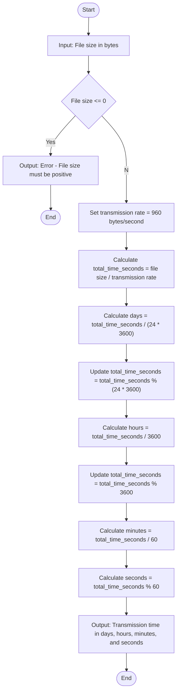

### Problem Analysis
  # Input
   - file_size: The size of the file in bytes (a positive number).
   
   
  # Opration
   - Calculate Total Transmission Time
   - Total Time in Seconds: **total_time_seconds= file size / transmission_rate**
   - Conversion to Days, Hours, Minutes, and Seconds:
   - Days: Calculate the number of complete days: **days = total_time_seconds / (24 × 3600)**
   - **remaining_seconds = total_time_seconds % ( 24 × 3600)**
   - **hours = remaining_seconds / 3600**
   - **remaining_seconds = remaining_seconds % 3600**
   - **minutes = remaining_seconds / 60**
   - **seconds = remaining_seconds % 60**

  # Output
   - time taken to transfer file in days, hours, minutes and seconds.

## Algorithm
       step 1: Start.
       step 2: input the file size in bytes.
       step 3: Validate Input: If file_size <= 0, display an error message and terminate the program.
       step 4: Calculate Total Transmission Time in Seconds: total_time_seconds = file_size / transmission_rate
       step 5: Convert Total Seconds to Days, Hours, Minutes, and Seconds as:
              step 5.1: **Days: days = total_time_seconds / 24 × 3600**
              step 5.2: **Update total_time_seconds: total_time_seconds = total_time_seconds % ( 24 × 3600 )**
              step 5.3: **Hours: hours = total_time_seconds / 3600**
              step 5.4: **Update total_time_seconds: total_time_seconds=total_time_seconds%3600**
              step 5.5: **Minutes: minutes = total_time_seconds / 60**
              step 5.6: **Update total_time_seconds: seconds=total_time_seconds % 60**
       step 6: Display the time in days, hours, minutes, and seconds.
       step 7: End.

## Flowchart

