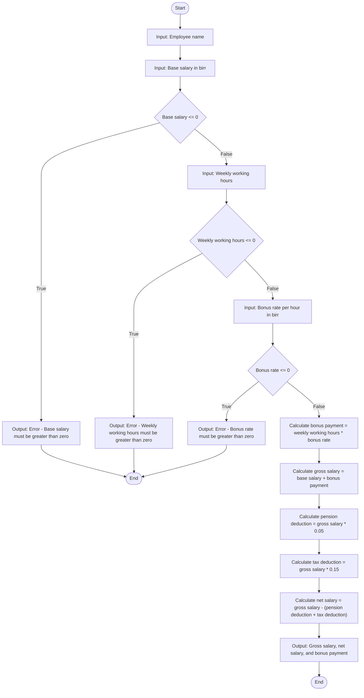

 ## problem analysis

 ### Inputs:
    1.base_salary: The base salary in birr (a positive double).
    2.employee_name: The name of the employee (a string).
    3.weekly_working_hours: The number of hours worked weekly (a positive double).
    4.bouns_rate_per_hour: The bonus rate per hour in birr (a positive double).
    
 ### Outputs:
    1.employee's gross salary in birr.
    2.employee's net salary in birr.
    3.employee's bonus payment in birr.

 ### Oprations:
    1.declare variables to store name, weekly working hour, pension deduction, tax deduction, bonus payment, gross salary, net          salary, bonus rate perhour, base salary and inialize pension = 0.05 and tax = 0.15
    2.read the inputs
    3.calculate 
        **bonus_payment = weekly working hour * bonus_rate perhour**
        **gross_salary = base salary + bonus payment**
        **pension_deduction = gross salary * pension**
        **tax_deduction = gross salary * tax**
        **net_salary = gross salary -(pension deduction + tax deduction)**
    4.print net salary, bonus payment and gross salary. 

 ## algorithm design
   ###  pesudocode
    1.start the program
    2.read  name, base salary,weekly working hour and bonus rate per hour
    3.calculate 
         -**Bonus Payment**: `bonus_payment = weekly_working_hours × bonus_rate_per_hour`
         - **Gross Salary**: `gross_salary = base_salary + bonus_payment`
         - **Deductions**:
              - Pension Deduction: `pension_deduction = gross_salary × 0.05`
              - Tax Deduction: `tax_deduction = gross_salary × 0.15`
         - **Net Salary**: `net_salary = gross_salary − (pension_deduction + tax_deduction)`
    4.print net salary, bonus payment and gross salary 
    5.end the program.

  ## Flowchart

